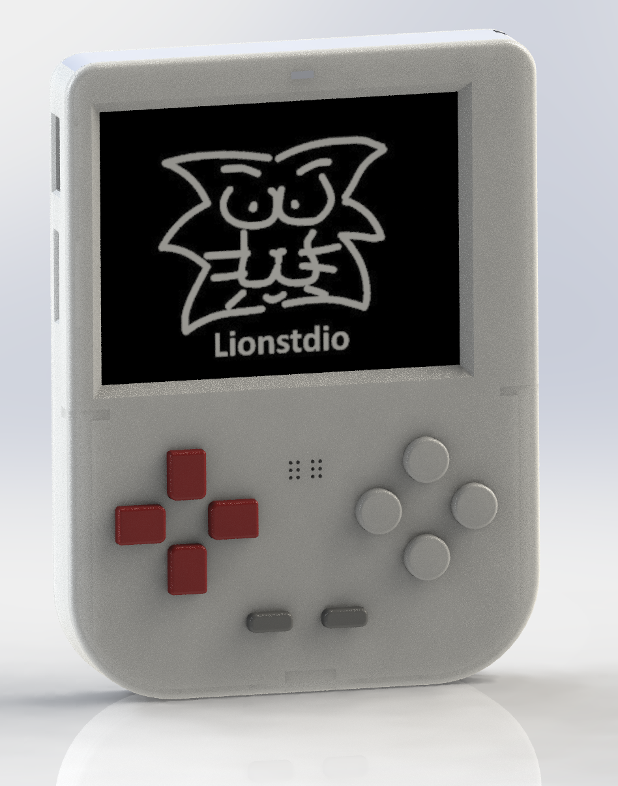
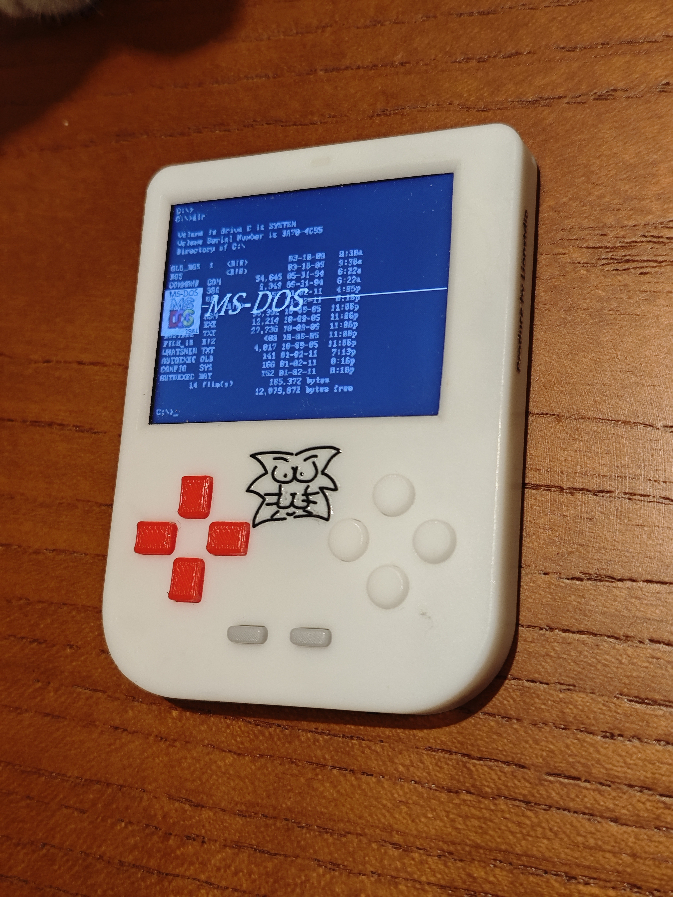

# retro-game-lionstdio
a retro games console 

# Brief introduction:
## firmware based on [retro-go](https://github.com/eaphone/retro-go) integrated gba, dos simulator. add wired coplay, video player.
GBA, [Dos simulator](assets/dos-effect.gif) and video player. 
 
| win95 runing on esp32 | LEGEND runing on esp32s3 | video player |
| ---- | ---- | ---- |
|  |  |  |

## hw use ili9342 drive 2.4 inch half transparent tft display, powered by esp32s3/p4
display without backlight, under sunshine effect \

# 3d print case without screw

# Notice:
- ec gudie refer to [PCB_EC](pcb/README.md#ec)
- manufacture and assemble gudie refer to [PCB_MANUFACTURE](pcb/README.md#manufacture) [3D_PRINT_MANUFACTURE](case/README.md#manufacture) [ASSEMBLING](case/README.md#assemble)
- firmware flash and develop gudie refer to [FLASHING](pcb/README.md#flashing) [BUILDING](pcb/README.md#building)

# Final product:

# Acknowledgements
this work is based on below awesome open source projects
- The retro-go is forked of the [retro-go](https://github.com/ducalex/retro-go) by ducalex and many others.
- The dos simulator is forked of the [tiny386](https://github.com/hchunhui/tiny386) by hchunhui.
- pcb desgin referred [虾哥小智游戏机](https://oshwhub.com/wdmomo/xiaozhi201) by wdmomo

# License
Everything in this project is licensed under the [GPLv2 license](COPYING)
